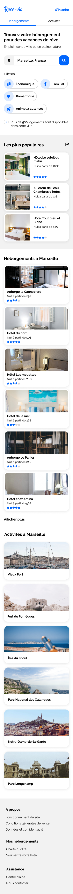

# Transformez une maquette en site web avec HTML & CSS
Projet n°2 du parcours développeur web chez OpenClassrooms qui a pour objectif d'intégrer du contenu conformément à une maquette et d'implémenter une interface responsive.

## Fonctionnalités
- Les usagers pourront rechercher des hébergements dans la ville de leur choix. Le champ de recherche est donc un champ de saisie, dont le texte peut être édité par l’usager. En revanche, à ce stade, le bouton de recherche ne sera pas fonctionnel.
- Chaque carte d’hébergement ou d’activité devra être cliquable dans son intégralité. Pour l’instant les liens seront vides.
- Les filtres ne seront pas fonctionnels pour cette version, en revanche, il faut qu’ils changent d’apparence au survol. Le Choix de l'effet est laissé libre.
- Dans le menu, les liens “Hébergements” et “Activités” sont des ancres qui doivent mener aux sections de la page.

## Contraintes techniques
- L'integration doit se faire en HTML5 & CSS3, sans framework ou précompilateur
- Deux maquettes sont fournies : l’une desktop et l’autre mobile. Le site devra également être adapté aux tablettes. Sur ce support, les adaptations nécessaires avec la mise en page sont libres, tant qu’aucun élément n’est coupé et que le texte a une taille suffisante. Le Choix des breakpoints appropriés est libre.
- Toutes les images présentes sur le site sont aussi livrés en format sm, md, l & xl.
- Les icônes proviennent de la bibliothèque Font Awesome. Les couleurs de la charte sont le bleu #0065FC, et sa version plus claire #DEEBFF ainsi que le gris pour le fond #F2F2F2.
- La police du site est Raleway.
- Les images doivent être de taille adéquate afin qu'elle soit le plus jolie possible en impactant le moins possible le temps de chargement de la page.
- Le code devra utiliser les balises sémantiques et ne doit contenir aucune erreur ni alerte au validateur W3C HTML et CSS.
- Le site devra être compatible avec les dernières versions de Chrome et Firefox.
- Le HTML et le CSS doivent être séparés et le dossier doit être organisé
- Le code doit être versionné avec git et doit avoir un repo distant sur Github ou Gitlab

## maquette version desktop

## maquette version mobile

